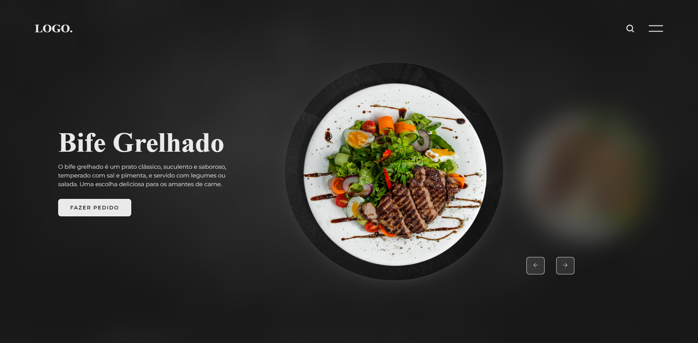

# 🍽️ Slider Restaurante


Projeto de estudo que consiste em uma página de restaurante com um **slider de pratos**. A cada troca de slide, o texto de apresentação e a imagem do prato mudam juntos, com navegação pelos botões de seta. O objetivo foi praticar a construção de um slider do zero, sincronizando dois grupos de elementos com JavaScript.

🔗 **[🚀 Clique aqui para ver o projeto online](https://acali10.github.io/SliderRestaurante/)**
---

## 📷 Demonstração



---

## ✨ Funcionalidades

- Slider com **4 pratos**: Bife Grelhado, Porco Assado, Filé de Frango e Macarrão.
- **Texto e imagem sincronizados:** ao trocar de slide, o título, a descrição e a foto do prato mudam juntos.
- **Botões de navegação** (anterior e próximo) para percorrer os pratos.
- **Header** com logo e ícones de busca e menu.
- Botão **Fazer pedido** em cada prato.

---

## 🛠️ Tecnologias e Conceitos Aplicados

- **HTML5:** estrutura da página em blocos (`header`, textos, imagens e navegação) e textos alternativos (`alt`) nas imagens.
- **CSS3:** estilização do layout, do slider e dos botões.
- **JavaScript:** controle do slide ativo por meio da classe `.ativo`, aplicada ao mesmo tempo no texto (`.texto`) e na imagem (`.prato`) correspondentes.
- **Script no final do `<body>`:** o `script.js` é carregado depois do HTML, garantindo que os elementos já existam quando o código executar.

---

## 💻 Como rodar o projeto localmente

1. Clone o repositório:

```
git clone https://github.com/acali10/SliderRestaurante.git
```

2. Acesse a pasta do projeto:

```
cd SliderRestaurante
```

3. Abra o arquivo `index.html` em seu navegador.

---

## 🔜 Melhorias futuras

- Adicionar troca automática de slides (autoplay) com pausa ao passar o mouse.
- Permitir navegação pelo teclado e por gestos de arrastar (swipe) no mobile.
- Adicionar indicadores (bullets) mostrando qual prato está ativo.
- Melhorar a acessibilidade (textos alternativos mais descritivos e `aria-label` nos botões de seta).

---

## 👤 Autora

Desenvolvido por Caline Nepomoceno:

- GitHub: [@acali10](https://github.com/acali10)